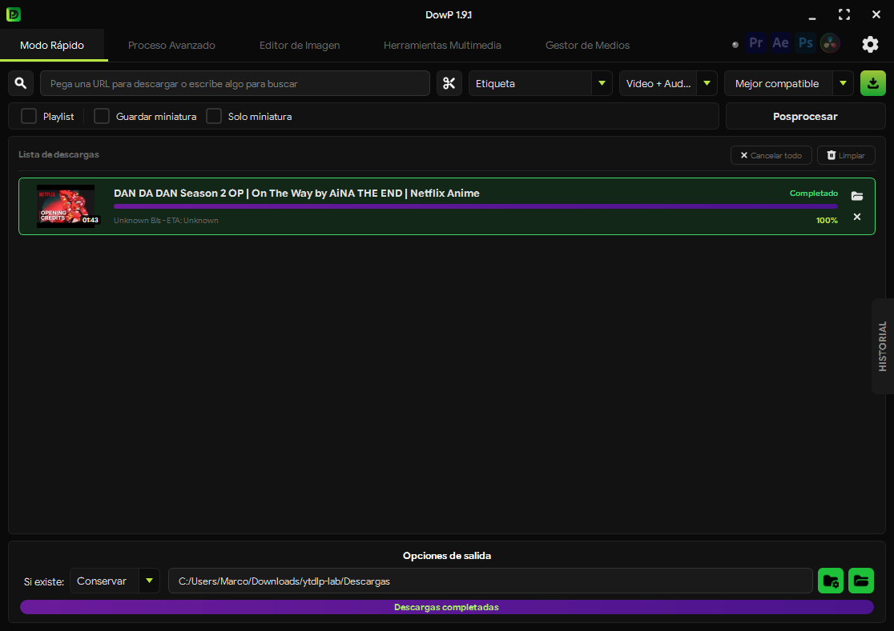
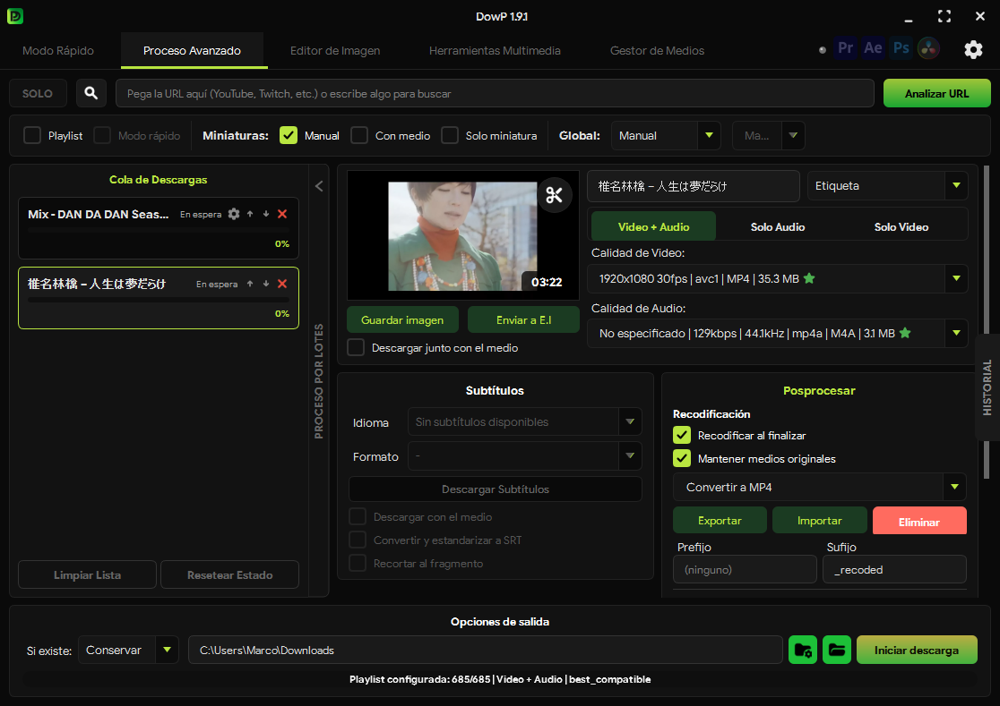
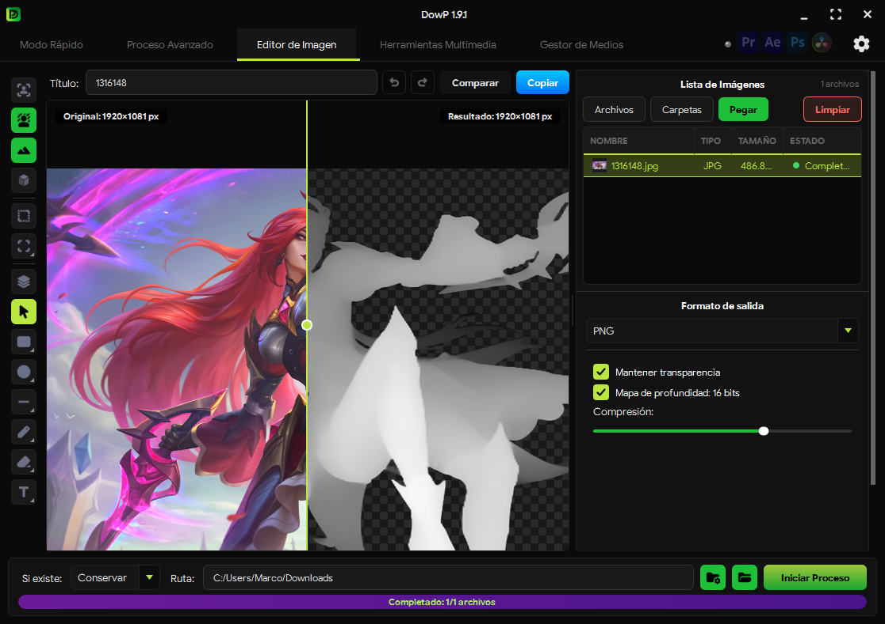
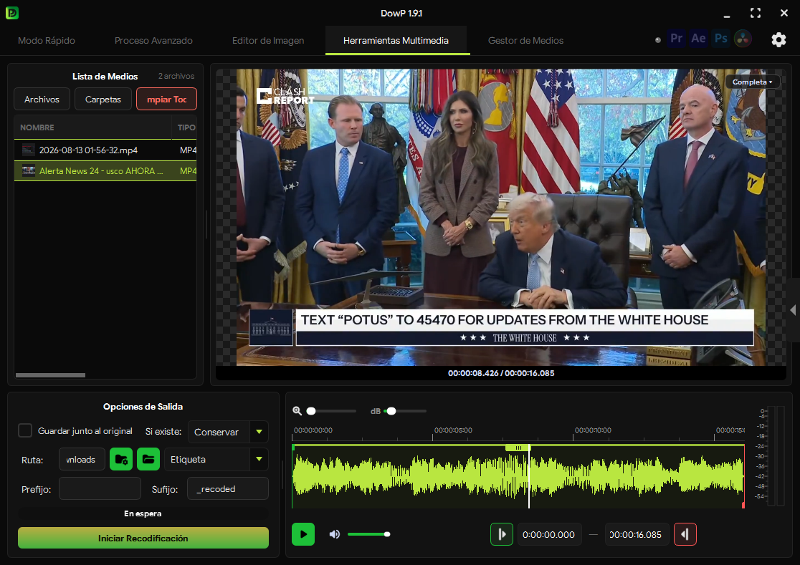
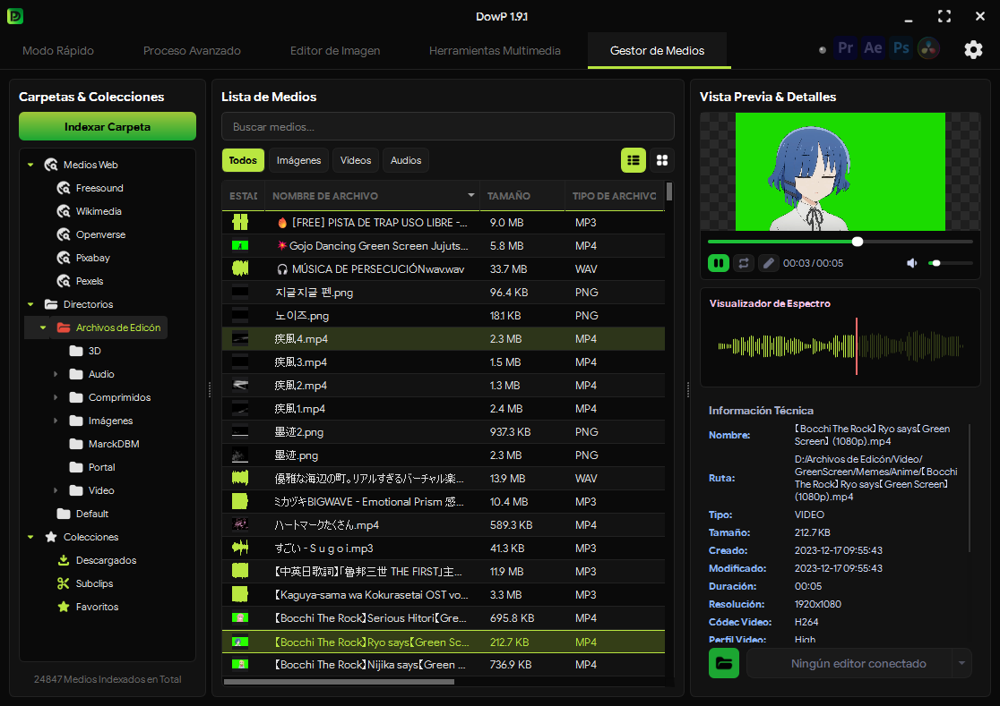

<p align="center">
  
</p>

<h1 align="center">DowP</h1>

<p align="center">
  <strong>Descarga, convierte y organiza tus medios, y mándalos directo a tu editor.</strong><br>
  <sub>Versión 1.9.1 · Beta previa a DowP 2.0</sub>
</p>

<p align="center">
  <a href="https://marckdp.github.io/DowP/"><strong>⬇ Descargar</strong></a> ·
  <a href="https://github.com/MarckDP/DowP/releases">Releases</a> ·
  <a href="https://github.com/MarckDP/DowP/issues">Reportar un error</a>
</p>

<p align="center">
  
</p>

---

## ¿Qué es DowP?

DowP empezó como un descargador de videos y creció hasta convertirse en una navaja suiza para
quien edita. Descarga video y audio de YouTube y de cientos de sitios más (gracias a
[yt-dlp](https://github.com/yt-dlp/yt-dlp)), convierte y edita imágenes, recodifica y recorta
video y audio, y organiza toda tu biblioteca de medios.

Y todo termina donde lo necesitas: DowP se conecta con **Premiere Pro**, **After Effects**,
**Photoshop** y **DaVinci Resolve**, o puedes arrastrar lo que quieras directamente a cualquier
editor.

## Funciones

| | |
|---|---|
| **Modo Rápido** | Pega un enlace, elige video o audio y descarga. |
| **Proceso Avanzado** | Calidad de video y audio, subtítulos, miniaturas, recorte de fragmentos y descargas por lotes o de playlists completas. |
| **Buscador integrado** | Busca videos, canales y listas de YouTube y SoundCloud sin salir de la app. |
| **Editor de Imagen** | Convierte entre formatos (incluidos HEIC, AVIF, PSD y RAW), pasa PDF a imágenes, vectoriza a SVG y quita fondos con IA. |
| **IA para imagen y video** | Mapas de profundidad y de normales para imágenes y videos, con varios modelos a elegir, y reescalado de video. |
| **Herramientas Multimedia** | Recodificación con preajustes y recorte preciso sobre la forma de onda. |
| **Gestor de Medios** | Indexa tus carpetas, crea colecciones y subclips, y busca material libre en Freesound, Wikimedia, Openverse, Pixabay y Pexels. |
| **Envío a editores** | Panel **DowP Importer** para Premiere Pro, After Effects y Photoshop, integración con DaVinci Resolve y arrastre universal. |
| **Historial** | Todo lo que descargaste, en un solo lugar. |
| **Actualizaciones automáticas** | Solo descarga lo que cambió, verifica cada actualización con firma digital y vuelve a la versión anterior si algo falla. |
| **Idiomas** | Español, inglés y portugués (Brasil). |

<details>
<summary><strong>Más capturas</strong></summary>

<br>

**Proceso Avanzado**


**Editor de Imagen**


**Herramientas Multimedia**


**Gestor de Medios**


</details>

## Descarga

| Sistema | Archivo | Estado |
|---|---|---|
| Windows 10/11 (64 bits) | `DowP_Setup_<versión>.exe` | ✅ Disponible |
| macOS con Apple Silicon (M1, M2…) | `DowP-<versión>-arm64.dmg` | 🧪 Beta, con pocas pruebas |
| macOS con Intel | — | ⏳ Pronto |
| Linux | — | Algún día |

Descárgalo desde la [página de DowP](https://marckdp.github.io/DowP/) o desde
[Releases](https://github.com/MarckDP/DowP/releases). Solo hace falta instalarlo una vez:
después DowP se actualiza solo.

**Windows:** el instalador no pide permisos de administrador; DowP se instala en tu perfil de
usuario.

**macOS:** DowP no está notarizado por Apple, así que la primera vez macOS lo bloquea. Ábrelo
desde *Ajustes del Sistema → Privacidad y seguridad → Abrir igualmente*, o desde la Terminal:

```bash
xattr -dr com.apple.quarantine /Applications/DowP.app
```

Las herramientas pesadas (FFmpeg, modelos de IA…) se descargan la primera vez que las necesitas
y se guardan fuera de la carpeta de instalación, así que sobreviven a las actualizaciones.

## Panel para Adobe (DowP Importer)

El panel viene incluido en DowP. Para instalarlo:

1. Abre DowP y ve a **Ajustes → Integraciones**.
2. Pulsa **Instalar panel**.
3. Reinicia Premiere Pro, After Effects o Photoshop y ábrelo desde **Ventana → Extensiones → DowP Importer**.

El panel se configura solo al conectarse con DowP y se actualiza junto con la app.

## Estructura del repositorio

```
app/         La aplicación (Python + PySide6)
  src/       Código fuente
  main.py    Punto de entrada
importer/    Panel CEP para Premiere Pro, After Effects y Photoshop
docs/        Página de descargas (GitHub Pages)
tools/       Herramientas del publicador de actualizaciones
```

## Ejecutar desde el código fuente

Requiere **Python 3.11**.

```bash
python -m venv .venv
# Windows: .venv\Scripts\activate    ·    macOS/Linux: source .venv/bin/activate
pip install -r app/requirements.txt
cd app
python main.py
```

El sistema de actualizaciones no hace nada al ejecutar desde el código fuente: solo funciona en
las versiones compiladas.

## Hecho con

[yt-dlp](https://github.com/yt-dlp/yt-dlp) ·
[FFmpeg](https://ffmpeg.org/) ·
[PySide6 / Qt](https://doc.qt.io/qtforpython-6/) ·
[ONNX Runtime](https://onnxruntime.ai/) ·
[Pillow](https://python-pillow.org/)

La lista completa, con la licencia de cada proyecto, está en la
[página de créditos](https://marckdp.github.io/DowP/creditos.html) y en la app
(*Ajustes → Acerca de → Créditos y licencias*).

## Apoya DowP

DowP es gratis y lo seguirá siendo. Si te resulta útil, puedes apoyarlo:

- ☕ [Invítame un café en Ko-fi](https://ko-fi.com/marckdbm)
- **Binance Pay** — Binance ID (UID): `345789454` (solo desde la app de Binance)

Sígueme en [X (@MarcklaX)](https://x.com/MarcklaX).

## Licencia

DowP es software libre: puedes usarlo, estudiarlo, modificarlo y compartirlo bajo los términos de
la [GNU General Public License v3.0 o posterior](LICENSE). Cualquier versión modificada que se
distribuya debe seguir siendo libre, con su código disponible y bajo la misma licencia.

El nombre **DowP** y su logo son de MarckDP: las versiones modificadas deben usar otro nombre.

---

<details>
<summary><strong>English</strong></summary>

<br>

**DowP** downloads video and audio from YouTube and hundreds of other sites, converts and edits
images, re-encodes and trims video and audio, and organizes your media library. It sends
everything straight to **Premiere Pro**, **After Effects**, **Photoshop** and **DaVinci Resolve**,
or lets you drag it into any editor.

Highlights: Quick Mode, advanced downloads (quality, subtitles, thumbnails, batches and
playlists), built-in YouTube/SoundCloud search, an image editor with AI background removal,
depth and normal maps for images and video, AI video upscaling, a media manager with free
sources (Freesound, Wikimedia, Openverse, Pixabay, Pexels), download history and automatic,
signed updates.

DowP is free software released under the [GPL-3.0-or-later](LICENSE) license. You can support it on
[Ko-fi](https://ko-fi.com/marckdbm).

The interface is available in Spanish, English and Brazilian Portuguese.
[Download it here](https://marckdp.github.io/DowP/). Windows 10/11 and Apple Silicon Macs (beta)
are supported; Intel Macs are coming soon.

</details>

<p align="center"><sub>Hecho por <a href="https://github.com/MarckDP">MarckDP</a>, con ayuda de IA</sub></p>
